# News Sarcasm Detection

In this Repository help you to understand how to use `Recurrent Neural Network` (RNN) and `Long short-term memory` to classify text. 

[News Sarcasm Detection](https://www.kaggle.com/rmisra/news-headlines-dataset-for-sarcasm-detection) from Kaggle to predict whether Headline is Sarcastic or not Sarcastic. 

To see RNN and LSTM working you can clone and run `News_Sarcasm_data.ipynb` file in your local machine.

# Loading the News Sarcasm Detection Data

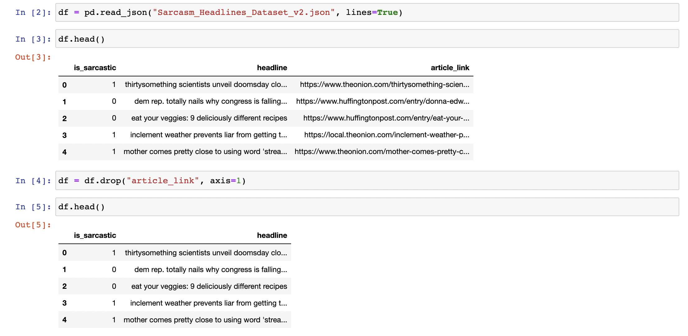

# Preprocessing the data

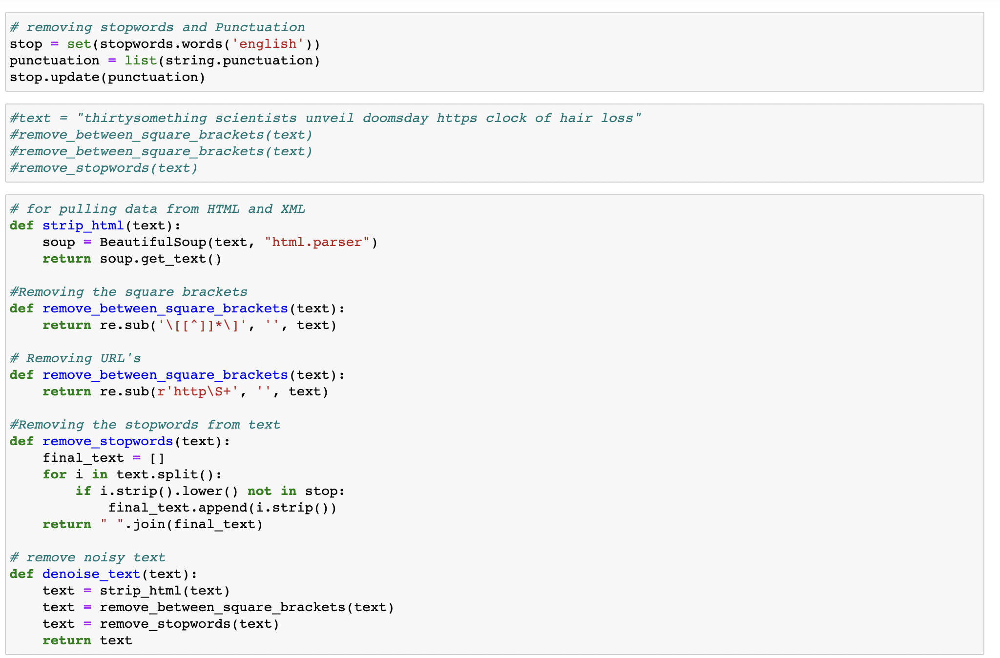

# Tokenizing the data

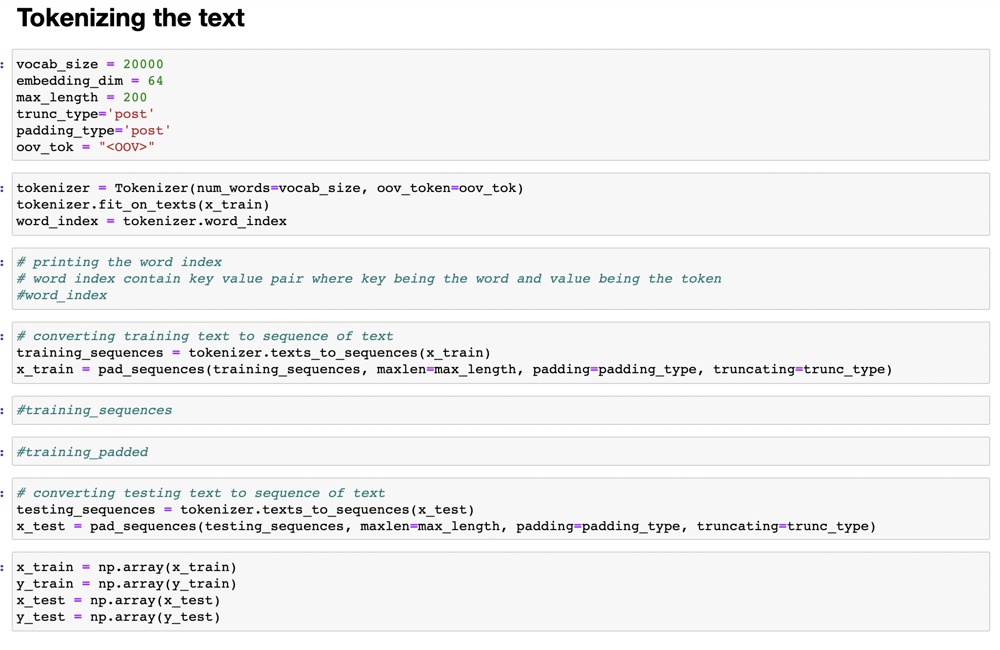

# Model with RNN and CNN 

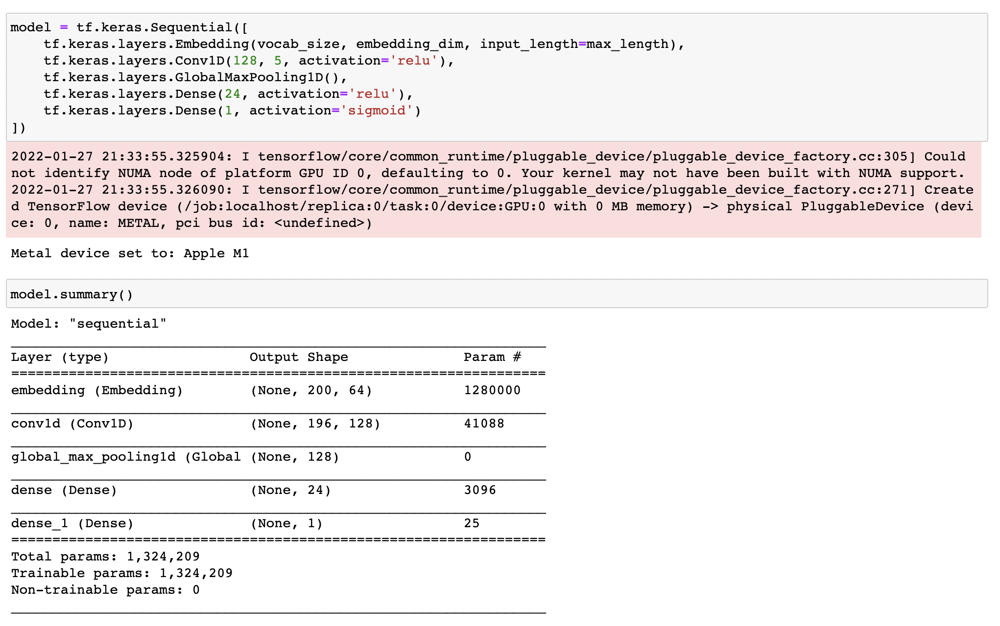

Model Accuracy on training and Validation dataset

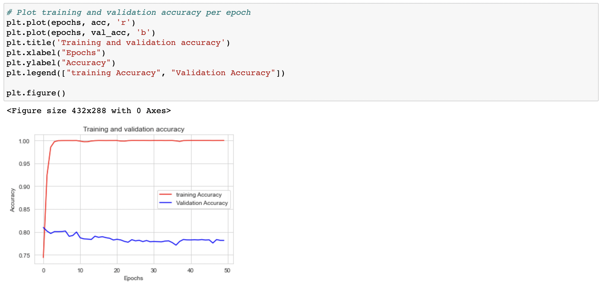

Model Accuracy on training and Validation dataset

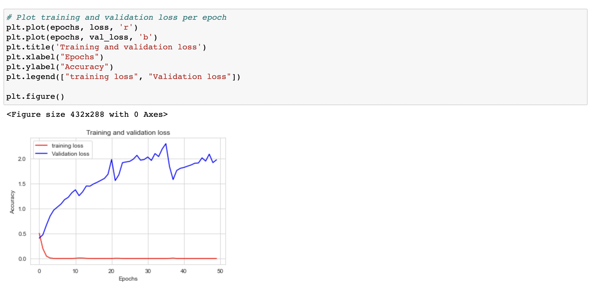

# Pre-trained Embedding model (Glove Twitter)

[Glove Twitter pre-trainned Embedding model](https://www.kaggle.com/icw123/glove-twitter)

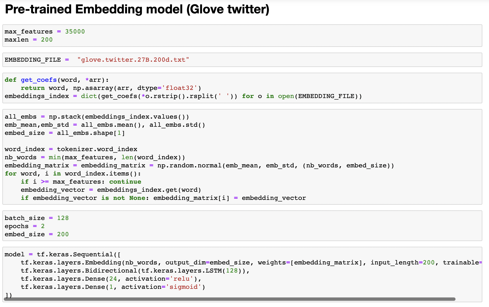

Model Accuracy on training and Validation dataset

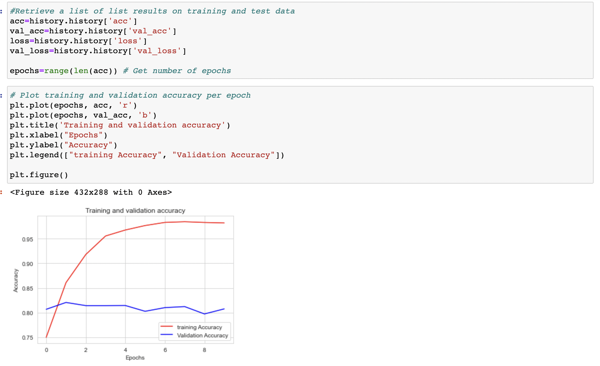

Model Accuracy on training and Validation dataset

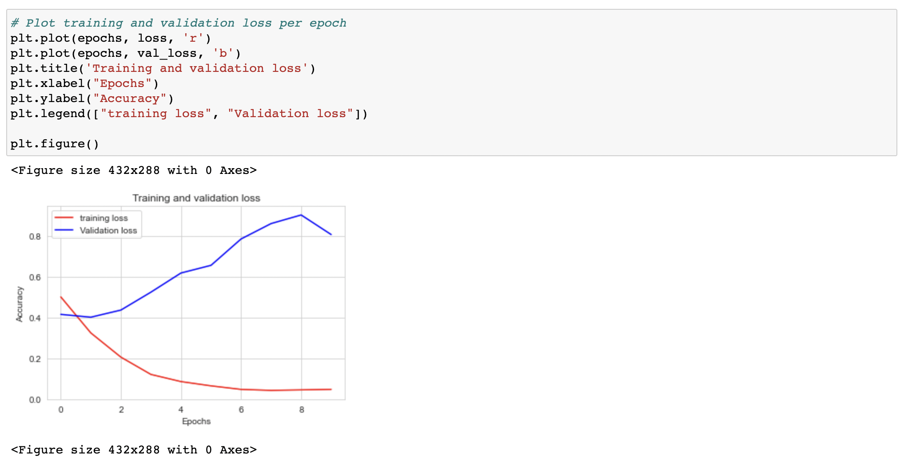

Classification and Confusion metrix

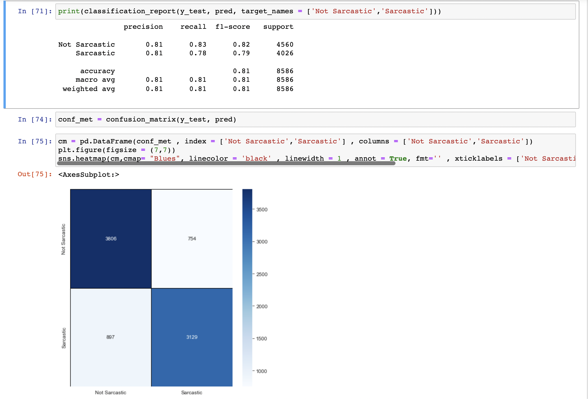

# Testing the model on unseen text

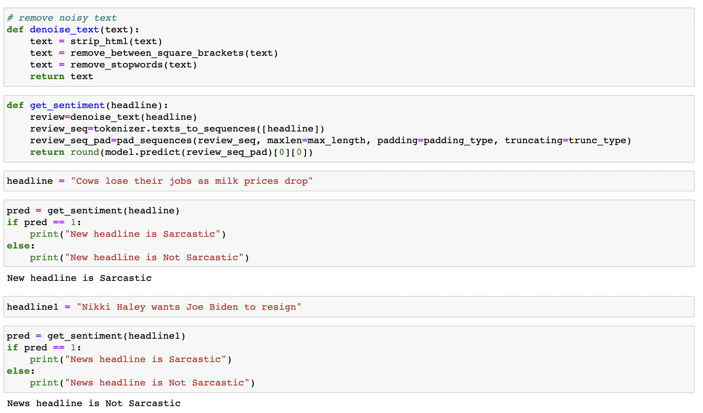

